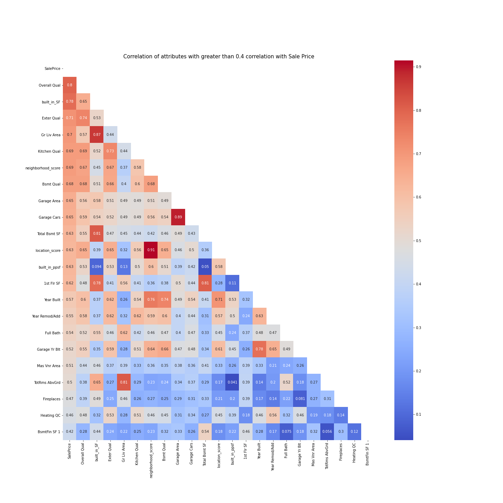
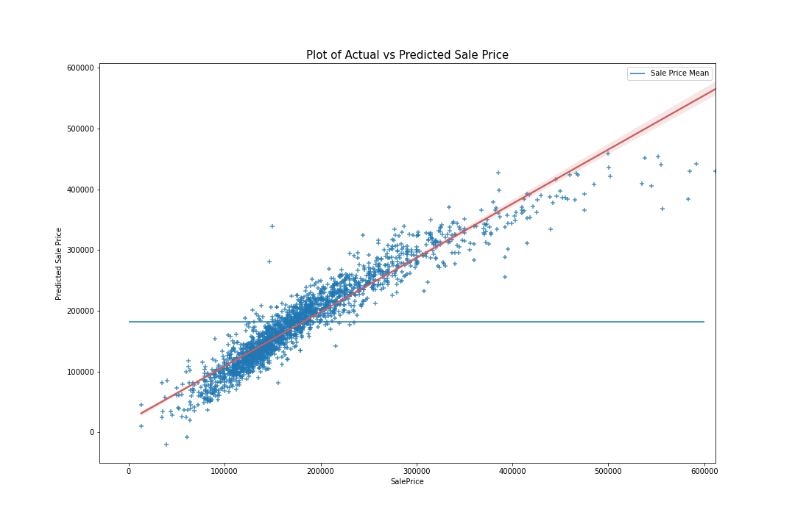
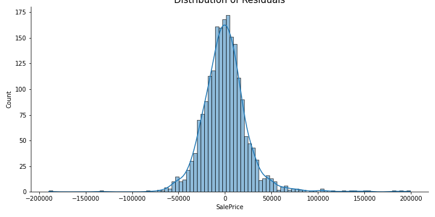

# Ames Housing: A Model for Price Prediction
---

## Preamble
This project aims at developing a machine learning for the prediction of housing prices using the Ames Housing data set, and identifying parameters that are most often used in determining the value of a property.

---

## Contents
* [1. Problem Statement](#chapter1)
    * [1.1 Context & Motivation](#chapter1_1)
    * [1.2 Primary & Secondary Stakeholders](#chapter1_2)
    * [1.3 Business Problem Statement](#chapter1_3)
    * [1.4 Data Science Problem Statement](#chapter1_4)
* [2. Data Dictionary](#chapter2)
    * [2.1 Original Ames Housing Data](#chapter2_1)
    * [2.2 Additional Parameters](#chapter2_2)
* [3. Executive Summary](#chapter3)
    * [3.1 Context & Initial Assumptions](#chapter3_1)
    * [3.2 Data Science Process](#chapter3_2)
    * [3.3 Key Findings](#chapter3_3)
* [4. Recommendations & Conclusion](#chapter4)
    * [4.1 Addressing Business Problem](#chapter4_1)
    * [4.2 Addressing Data Science Problem](#chapter4_1
* [5. Limitations](#chapter5)
    * [5.1 Long Term Predictions](#chapter5_1)
    * [5.2 Scope](#chapter5_2)
    * [5.3 Location Score](#chapter5_3)
* [6. Citations](#chapter6)

## 1. Problem Statement 

### 1.1 Context & Motivation 
Valuing a property is challenging due to the many different considerations involved. When a property is sold by a homeowner, it is often difficult to objectively decide if the value of the sale was appropriately priced, overvalued, or undervalued.

The Ames Housing data set has a comprehensive list of 81 different parameters that can help provide an insight to how properties can be objectively valued, and what are some of the key considerations taken into value of a property.

### 1.2 Primary & Secondary Stakeholders 
|Type|Stakeholders|Value Proposition|Problem Type|
|:--|:--|:--|:--|
|Primary|Front-end Property Consultants|- Insights into parameters that strongly affect value - How to best advise clients to increase the value of their properties|Business Problem|
|Secondary|Back-end Developers|- Which model best used to predict values - Insights on outliers and how to factor that into model building|Data Science|

### 1.3 Business Problem Statement 
Valuing a property is difficult due to the different parameters involved. High impact parameters may also differ from one area to another. For example, 1 sq ft in of built-in sq ft in Ames would have a much smaller impact to value compared to 1 sq ft in downtown New York. 

A successful outcome of this analysis would be to give insight to property consultants on what are the major parameters involved in valuing a property in Ames, allowing them to objectively evaluate a property based on its characteristics. This would also help them in advising their clients how best to increase the value of their property by suggesting improvements in high impact parameters.

### 1.4 Data Science Problem Statement 
The target variable in this problem is the value of the house, represented by the Sale Price which is observable, classifying it as a supervised machine learning problem. Given that the target is a continuous variable, linear regression models will be used. The Ames data set has many parameters provided that can either help or distort the model. The problem is which linear regression mode to use and how to best use the information provided from the parameters and creating the model that can generalise the best.

A successful outcome would be deriving an approach in treating the parameters and transforming the `object` variables into usable variables in the linear regression model. From there, the best linear regression model can be decided on to use for value prediction. A successful model will be a linear regression model that generalises well, defined as one that has a RMSE of < 50,000 in this case.

## 2. Data Dictionary 
The Ames data set has a total of 81 different parameters, consisting of 39 numerical variables and 42 object variables.

### 2.1 Original Ames Housing Data 
A detailed description of each variable in the data set can be found [here](http://jse.amstat.org/v19n3/decock/DataDocumentation.txt).

### 2.2 Additional Parameters 
In addition to the original parameters, there were additional features engineered along the way.
|Feature|Data Type|Data Description|
|:--|:--|:--|
|`built_in_SF`|Numerical > 0|Built-In sq ft. Represents the total built-in area in sq ft. Components of built-in area are: -`Total Bsmt SF` -`Gr Liv Area` -`Wood Deck SF` -`Open Porch SF` -`Enclosed Porch` -`Screen Porch` -`3Ssn Porch`|
|`built_in_ppsf`|Numerical > 0|Built-in price per sq ft. Represents the Sale Price divided by total built-in area.|
|`land_ppsf`|Numerical > 0|Land price per sq ft. Represent the Sale Price divided by land area (`Lot Area`).
|`MS Zoning_score`|Numerical 1 to 7|Assigns a score based on `MS Zoning`.|
|`neighborhood_score`|Numerical 1 to 11|Assigns a score based on `Neighborhood`|
|`access`|Numerical -2 to 2|Assigns a score based on `Condition 1` and `Condition 2`|
|`location_score`|Numerical 0 to 20|Combined `MS Zoning_score`, `neighborhood_score`, and `access` to assign a total score|

## 3. Executive Summary 

### 3.1 Context & Initial Assumptions 
The value of a property is generally assumed to be measured on 3 main factors.
1. Location
2. Size
3. Features

The location of a property is often the main determinant of the value of the house. Good locations provide for good neighborhoods with convenient access to many residential amenities such as groceries, retail locations, and schools. 

Another important factor is the size of the house. Typically, the bigger the house, the more valuable it is.

Lasly, features such as a nice sized yard, a pool, good quality of furnishings will also help to increase the value of the house.

Through this analysis, the main determinants of value for property in Ames will be further looked at.

### 3.2 Data Science Process 
Given that the target (Sale Price) is a continuous varaible, linear regression models will be used. The process flow is as follows.

1. [Data Cleaning](./code/01_data_cleaning.ipynb)
 - Data validation
 - Removal/Imputation of null values
2. [Initial Feature Engineering](./code/02_initial_feature_engineering.ipynb)
 - Dealing with ordinal object variables
 - Feature based on size
 - Feature based on location
3. [Exploratory Data Analysis (EDA)](./code/03_eda.ipynb)
 - Correlation Analysis
 - Identification and Removal of Outliers
 - Convertin remaining object variables
4. [Model Selection and Evaluation](./code/04_model_training_and_evaluation.ipynb)
 - Instantiating Linear Regression Models (`Standard Linear`, `Lasso`, `Ridge`, and `ElasticNet`)
 - Model Selection based on Cross Validation Score
 - Model Fitting and Evaluation
 - Identifying Further Possible Outliers and Refining Model
 - Re-Fitting Model and Evaluation
 - Summary of Findings
 - Limitations

### 3.3 Key Findings 

#### 3.3.1 Data Cleaning
Observed that there were 5 columns with >32% null values and were therefore removed. 32% was used as a threshold as 68% of the data in a normal distribution falls within 1 std dev of the mean. The alternative was to impute these values but due to the high % of null values, imputing the values poses more risks than benefits to the model, given that we still have 76 variables left. The variables removed are:
- `Pool QC`: 99.56% null values
- `Misc Feature`: 96.83% null values
- `Alley`: 93.17% null values
- `Fence`: 80.50% null values
- `Fireplace Qu`: 48.76% null values

#### 3.3.2 Initial Feature Engineering
- Observed that `Overall Qual` has a very high correlation with the target variable
- Neighborhoods tends to have a build-in price per sq ft that is minimally spread around the mean

#### 3.3.3 Exploratory Data Analysis
**Correlation**

The correlation heatmap shows the variables with the highest correlation to the target are:
- `built_in_SF`: Engineered feature that represents total built-in area in SF
- `Overall Qual`: Represent the overall quality of the property, which is a combination of the other quality variables
- `Gr Liv Area`: Above ground living area in sq ft, a component of `built_in_SF`
- `Exter Qual`: Quality of the material of the exterior, a component of the `Overall Qual`
- `Kitchen Qual`: Quality of the kitche, component of the `Overall Qual`
- `neighborhood_score`: Engineered feature assigning a score to the neighborhood

Out of the 6 parameters above, if the parameters that are components of each other are excluded, `built_in_SF`, `Overall Qual` and `neighborhood_score` remains. This reaffirms the assumptions held earlier on how the main components of value are Location (`neighborhood_score`), Size (`built_in_sf`), and features (`Overall Qual`).

**Outliers**
2 data points were identified as outliers. These 2 properties have a large built-in sq ft of more than 8,000 sq ft with a mean built-in price per sq ft that was more than 3 std dev away from the mean, compared to other properties within the same neighborhood. The outliers were removed to prevent distortions in the model.

#### 3.3.4 Model Selection and Evaluation
- Based on the cross validation of 4 models (`Linear Regression`, `Lasso`, `Ridge`, and `Elastic Net`), `Lasso` best optimises for low variance and low bias, and will be used as the selected model
- Running `Lasso` on the test data reveals a plot of predicted vs actuals as follows

- The `Lasso` R2 score is 0.9008 and with RMSE of 24,971
- The residuals also follow a normal distribution

- `Lasso` is evaluated to be the right model used for modeling
- Due to the multiple parameters involved, 25 of the parameters were also assigned a `Lasso` weight of 0, indicating that these parameters were not useful in refining the model
- These parameters were subsequently removed along with an additional data point identified as a possible outlier and fitted to another instance of `Lasso`
- However, the refined instance returned a R2 score of 0.9047 and RMSE 24,476, which was not materially different from the first instance

## 4. Recommendations & Conclusion 

### 4.1 Addressing Business Problem 
**Objectively valuing a property**
From the findings, it can be concluded that in order to appropriately value a property, the 3 main parameters that should be considered are:
- Location, based on the specific neighborhood the property is located in
- Size, looking at the built-in square feet
- Overall quality of the property.

Given that the overall quality is a function of the quality of different aspects of the property, the highest correlated parameters to `Overall Qual` are:
- `Exer Qual`, which looks at the material and finish of the external facade, implying that first impressions are extremely important
- `Kitchen Qual`, implying that one of the most important aspect of the house it the kitchen
- `Bsmt Qual`, the second most important feature in the house that contributes to the overall quality

Given the overall quality of the house, property consultants are able to onjectively measure the value of a property based on the price per built-in square feet of that neighborhood.

**Advisory Services**
In advising clients, given that there is no way for a client to change the neighborhood or the size of the house (although it can be remodeled but this is considered an extreme solution), the best way to improve the price of the house is to focus on 3 areas. 
- Exterior facade
- Kitchen
- Basement
Improving the finishing of these 3 areas will have the highest impact in increasing the value of their property as these parameters will help increase the overall quality of the house, which has a high correlation to sale price.

### 4.2 Addressing Data Science Problem 
The final RMSE score attained from unseen data was around 30,000, indicating that the model selected, `Lasso`, was appropriate and generalised well. The approach taken for the `object` variables was to ordinally rank some parameters and use Scikit's OneHotEncoder on those that could not be ranked. This was particularly useful as it prevented the creation of too many columns which could introduce a lot more noise into the model. It was also identified that outliers could be identified using pairplots and further investigated before deciding if they should be removed or not.

It was also tested if removing the parameters with `Lasso` weight of 0 could help improve the model. However, the RMSE score had no significant difference when the parameters were removed, providing no conclusive evidence that removing those coefficients would help refine the model. This could possibly be due to the use of OneHotEncoder, where the parameters were not split into multiple columns, causing the weight of 0 to already completely remove the particular parameter. Further testing could be done if this approach was taken with GetDummies instead of OneHotEncoder.

## 5. Limitations 
### 5.1 Long Term Predictions 
The model that has been built has shown to be rather accurate at predicting properties. However. this model runs on past data and is only as good as how recent the database is. While it may be quite accurate in terms of predicting the value of a property in the next 1 or 2 years, it will not be able to predict the potential value in a longer period of time (5 or more years) that would be more for investment purposes. 

### 5.2 Scope 
The scope of this model is contained to prediction of properties that already have buildings/houses built due to the nature of the data. Therefore, when it comes to predicting the value of an area of land for example, the scope would be different and results would not be reliable.

### 5.3 Location Score 
The model relied on a engineered feature `neighborhood_score`, which assigned a ordinal value to the different neighborhoods based on the mean of that neighborhood's `built_in_ppsf`. While this may be a good past indicator in terms of value of a neighborhood value, it might not take into factor future developments. Therefore, increased development in infrastructure in retail & dining, healthcare, education that are important in determining the value of a neighborhood will not be factored in only until there are enough eventual sales in that neighborhood. Therefore, in the data collection process, it would be good to consider collection of data points such as proximity to positive public infrastructure to further refine predictions.

## 6. Citations 
Gomez, J. (2019, September 19). 8 critical factors that influence a home’s value. Opendoor.     https://www.opendoor.com/w/blog/factors-that-influence-home-value

Chong, J. (2020, December 11). Guide to Encoding Categorical Features Using Scikit-Learn For Machine Learning. Medium. https://towardsdatascience.com/guide-to-encoding-categorical-features-using-scikit-learn-for-machine-learning-5048997a5c79